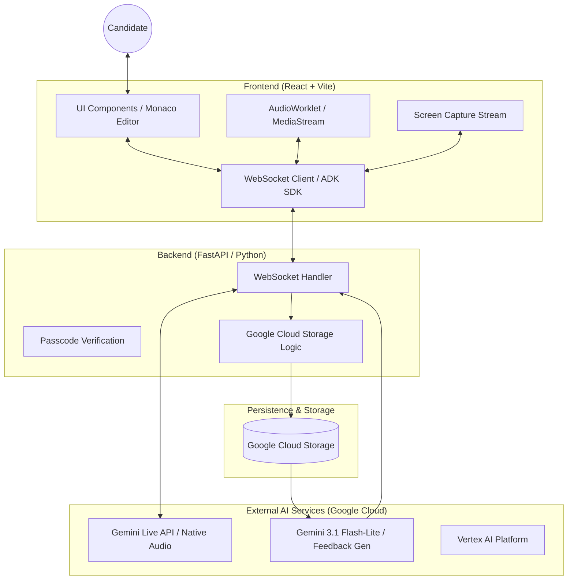
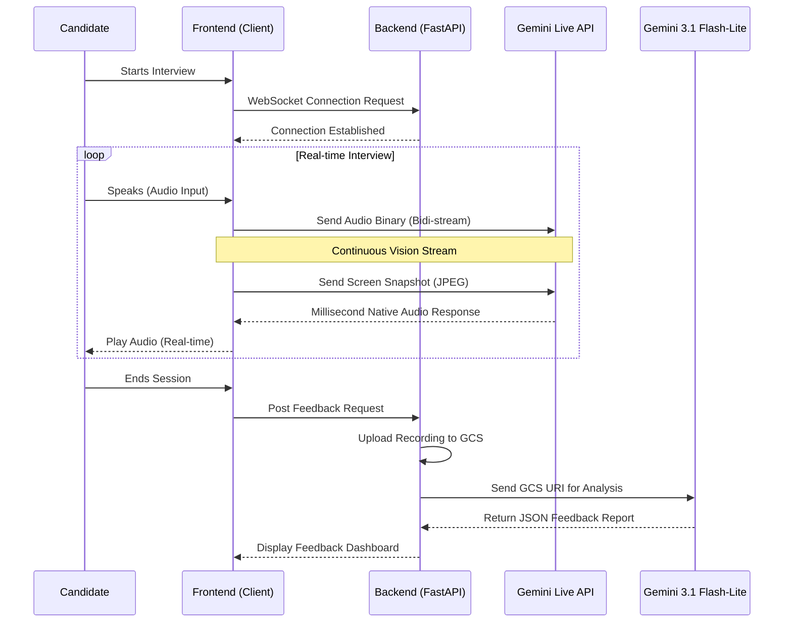

# MockInterview.ai Architecture & Design

This document details the technical implementation and user workflows of **MockInterview.ai**, built for the **Gemini Live Agent Challenge**.

## 1. High-Level System Architecture

This diagram illustrates the core components and how they communicate.

---

## 2. Sequence Diagram: Live Session & Feedback

This diagram shows the real-time flow of multimodal data followed by the asynchronous feedback generation.

---

## 3. Use Case Diagram

How the candidate interacts with the platform.

```mermaid
graph TD
    Actor((Candidate))
    
    subgraph "MockInterview.ai"
        UC1(Select Interview Mode)
        UC2(Upload Resume & Personalize)
        UC3(Conduct Live Interview)
        UC3a(Real-time Coding/Vision) 
        UC3b(Whiteboarding)
        UC4(Review AI Coaching Feedback)
        UC5(Manage Interview History)
    end
    
    Actor --> UC1
    Actor --> UC2
    Actor --> UC3
    UC3 --> UC3a
    UC3 --> UC3b
    Actor --> UC4
    Actor --> UC5
    
    style Actor fill:#3b82f6,stroke:#fff,stroke-width:2px
    style UC3 fill:#1e1e2e,stroke:#3b82f6,stroke-width:2px
```

---

## 4. Multimodal Data Engineering

| Data Type | Frequency | Tech Stack | Role |
| :--- | :--- | :--- | :--- |
| **User Audio** | Continuous | `AudioWorklet` (16kHz) | Direct Voice communication |
| **AI Audio** | Real-time | `Native Audio` (Bidi) | Zero-latency human-like response |
| **Code Vision** | Every 2s | `MediaStream` -> `JPEG` | Real-time code analysis & advice |
| **Whiteboard** | Change-based | `tldraw` Snapshot | Visualizing architectural patterns |
| **Session State** | Event-based | `FastAPI WebSockets` | Orchestration & Orchestration |

---

## 5. Deployment Strategy

* **Frontend**: Hosted on **Cloud Run** or **Vercel** with global CDN.
* **Backend**: Pre-authenticated **Cloud Run** containers for low-latency scaling.
* **Storage**: **Google Cloud Storage** for interview recordings (WebM) and AI feedback persistence.
* **Environment**: Uses `GOOGLE_API_KEY` for ADK authentication and Google Application Credentials for GCS.
