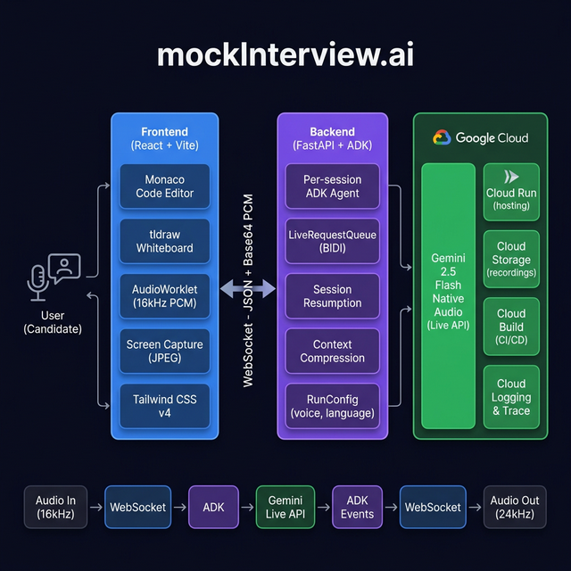

# 🏆 MockInterview.ai — Gemini Live Agent Challenge

> **Category: Live Agents 🗣️**  
> An AI interviewer that talks, listens, sees your screen, and coaches you — all in real-time up to 25 minutes session.

---

## 📖 For Judges — Start Here

Welcome! This document is your **complete guide** to evaluating MockInterview.ai. It covers:

| Section | What You'll Learn |
|---|---|
| [🎯 Problem & Solution](#-the-problem--our-solution) | Why we built this and what value it brings |
| [🔥 Agent Capabilities](#-agent-capabilities) | What makes our Live Agent unique |
| [🏗️ Architecture Deep Dive](#️-architecture) | How Gemini, ADK, and Cloud work together |
| [🧪 Try It Yourself](#-try-it-yourself) | Spin-up instructions (< 2 min) |
| [☁️ Cloud Deployment Proof](#️-cloud-deployment) | GCP services in action |
| [🎨 Bonus Points](#-bonus-points) | Automated deployment, GDG, content |

> 📐 For detailed architecture diagrams, see **[ARCHITECTURE.md](../ARCHITECTURE.md)**.

---

## 🎯 The Problem & Our Solution

### The Story Behind MockInterview.ai

I'm **Christ Chadrak**, a software engineering student at Polytech University of Tours in France. I've applied to an apprenticeship program at my dream tech company — **Google**. While grinding LeetCode and hoping to receive a potential email for an interview invitation, I needed to get very serious about preparing. But I quickly realized that grinding LeetCode alone is not sufficient.

I had no way to truly prepare. I could solve LeetCode problems alone, but that's not what a Google interview feels like. A real interview is a **conversation** — someone watches you code, asks follow-up questions, pushes back on your approach, and evaluates how you think under pressure. No amount of solo grinding replicates that.

I looked for solutions:
- **LeetCode / HackerRank** → Practice alone. No feedback. No pressure. No human interaction.
- **Mock interviews with friends** → Nobody around me has done a Google interview. Inconsistent quality.
- **Paid coaching** → $150-300/hour. As a student, that's not an option.

**None of these replicate what it actually feels like to sit across from a senior engineer at Google.** So I built my own interviewer.

mockInterview.ai started as my personal tool to prepare for the most important interview of my life. I wanted an AI that could **talk to me naturally**, **watch my code in real time**, **challenge my thinking**, and **give me honest feedback** — exactly like a real Google interviewer would.

And thanks to the **Gemini Live API** and **Google ADK**, that's exactly what I built.

### What It Does

MockInterview.ai is an **AI interviewer powered by Gemini 2.5 Flash Native Audio** that:

| Capability | How It Works |
|---|---|
| **🎤 Talks to you naturally** | Real-time bidirectional audio via Gemini Live API — zero perceptible latency |
| **👁️ Watches your code** | Screen capture sent as JPEG frames — the AI comments on what it sees |
| **🧠 Thinks like a real interviewer** | Proactive intervention, Socratic questioning, never gives direct answers |
| **🎭 Has a personality** | 5 distinct voices (Puck, Kore, Fenrir, Charon, Aoede) |
| **📊 Gives structured feedback** | Detailed scores across 5 categories + personalized "you" coaching |

**This is not a chatbot. This is the interviewer I wish I had — and now anyone can use it to prepare its interviews.**

---

## 🔥 Agent Capabilities

### Breaking the Text Box Paradigm

Our agent leverages **every modality Gemini offers**:

```
┌─────────────────────────────────────────────────────┐
│              MULTIMODAL INPUT / OUTPUT               │
│                                                      │
│   USER → AGENT                  AGENT → USER         │
│   ─────────────                 ──────────           │
│   🎤 Voice (16kHz PCM)         🔊 Voice (24kHz PCM)  │
│   👁️ Screen (JPEG frames)      💬 Text (feedback)    │
│   ⌨️ Text (config messages)     🎭 Personality        │
│                                                      │
│   All channels are SIMULTANEOUS and REAL-TIME        │
└─────────────────────────────────────────────────────┘
```

### Three Interview Modes

#### 💻 Coding Interview
The AI watches you write code in a **Monaco editor** (VS Code engine) while you explain your approach.

- **15 problems** across Easy, Medium, and Hard difficulty
- The agent sees your code via screen capture and comments on your logic
- Forces Time & Space complexity analysis — never lets you skip it
- **Proactive**: If silent for 5-7 seconds, asks you to explain your thought process

#### 🏗️ System Design Interview
Interactive **tldraw whiteboard** — draw architecture diagrams while the AI could coach you.

- 6 classic system design problems (URL Shortener, Chat System, Twitter, etc.)
- Guides through: Requirements → Estimation → High-Level Design → Deep Dive → Bottlenecks
- Challenges trade-offs: *"Why Redis over Memcached here?"*

#### 🎭 Behavioral Interview
Voice-only mode with **STAR framework** coaching.

- 10 behavioral questions + Full Mock Interview mode
- Pushes for specifics: *"What exactly did YOU do?"*
- If a target company is specified, tailors questions to company culture

### Session Durability — Up to 30+ Minutes

Thanks to **Transparent Session Resumption** (`SessionResumptionConfig(transparent=True)`) and **Context Window Compression**, our agent maintains consistent, coherent conversations for **25-30+ minutes** — proving the reliability of the Gemini Live API for sustained, real-world interactions.

### Smart Time Management

The platform includes a countdown timer visible on screen. The AI can see the timer through its vision capability and naturally paces the interview:

- **Extendable Sessions**: The user can add +5 minutes at any time
- **Automatic wrap-up**: When time expires, the session disconnects gracefully
- The timer is **visible to the AI** through screen capture — no explicit notifications needed

### Personalized Agent Identity

Each voice has a **name and personality**. When you select "Kore" as your voice:
> *"Hi, I'm Kore, I'll be your interviewer today. Are you ready to get started?"*

---

## 🏗️ Architecture

> 📐 For complete Mermaid diagrams and data flow details, see **[ARCHITECTURE.md](../docs/ARCHITECTURE.md)**.

### System Overview



### Gemini & ADK Integration

| Component | Technology | Purpose |
|---|---|---|
| **Live Interview Engine** | `Gemini 2.5 Flash Native Audio` via **Google ADK** | Real-time bidirectional audio + vision |
| **Agent Framework** | `google.adk.agents.Agent` + `Runner.run_live()` | Per-session agent lifecycle |
| **Audio Transport** | `LiveRequestQueue` + `LiveRequest` (BIDI streaming) | Low-latency audio forwarding |
| **Session Durability** | `SessionResumptionConfig(transparent=True)` | Seamless reconnection for 30+ min sessions |
| **Context Management** | `ContextWindowCompressionConfig` (sliding window) | Prevents token overflow in long conversations |
| **Voice Configuration** | `SpeechConfig` + `PrebuiltVoiceConfig` | Per-session voice selection (5 voices) |
| **Proactive Behavior** | `ProactivityConfig(proactive_audio=True)` | Agent speaks when it detects silence |
| **Emotional Intelligence** | `enable_affective_dialog=True` | Adapts tone to candidate's emotional state |
| **Feedback Analysis** | `Gemini 2.0 Flash` | Video-based structured scoring |

### Audio Pipeline — Zero-Latency Design

```
Microphone → AudioWorklet (16kHz) → Base64 PCM chunks
    → WebSocket → FastAPI → LiveRequestQueue → Gemini Live API
    
Gemini Live API → ADK Events → WebSocket → Base64 PCM (24kHz)
    → AudioStreamer → Speaker
```

### RunConfig — Full Customization Per Session

```python
RunConfig(
    streaming_mode=StreamingMode.BIDI,
    response_modalities=["AUDIO"],
    session_resumption=SessionResumptionConfig(transparent=True),
    context_window_compression=ContextWindowCompressionConfig(
        trigger_tokens=100000,
        sliding_window=SlidingWindow(target_tokens=80000)
    ),
    speech_config=SpeechConfig(
        voice_config=VoiceConfig(
            prebuilt_voice_config=PrebuiltVoiceConfig(voice_name="Puck")
        ),
        language_code="en-US",
    ),
    proactivity=ProactivityConfig(proactive_audio=True),
    enable_affective_dialog=True,
)
```

Every parameter is **dynamic** — voice, language, and behavior change per session based on user preferences.

---

## 🧪 Try It Yourself

### Prerequisites

- [uv](https://docs.astral.sh/uv/getting-started/installation/) (Python package manager)
- [Node.js 20+](https://nodejs.org/)
- A GCP project with **Vertex AI API** enabled
- `gcloud auth application-default login`

### Run Locally (< 2 minutes)

```bash
git clone https://github.com/ChristChad-mv/mockInterview.ai.git
cd mockInterview.ai
make install && make playground
```

Open **http://localhost:8000** → Enter the passcode → Start an interview.

### Environment Variables

| Variable | Description |
|---|---|
| `GOOGLE_CLOUD_PROJECT` | Your GCP project ID |
| `GOOGLE_CLOUD_LOCATION` | Region (e.g., `us-central1`) |
| `ACCESS_PASSCODE` | Gate access to the app |
| `USE_VERTEXAI` | `True` for Vertex AI models |

---

## ☁️ Cloud Deployment

### Google Cloud Services Used

| Service | Usage |
|---|---|
| **Cloud Run** | Hosts the full application (FastAPI + React SPA) |
| **Vertex AI** | Gemini 2.5 Flash Native Audio (Live Interview) |
| **Cloud Storage** | Interview video recordings (WebM) |
| **Cloud Build** | CI/CD pipeline for automated deployments |
| **Cloud Logging** | Structured session logs and error tracking |
| **Cloud Trace** | End-to-end OpenTelemetry distributed tracing |

### Automated Deployment (Infrastructure as Code)

```bash
# 1. Provision GCP resources via Terraform
make setup-dev-env

# 2. Build and deploy to Cloud Run
make deploy
```

All infrastructure is defined in `deployment/terraform/` — fully reproducible.

### Cloud Build Configuration

Located in `.cloudbuild/staging.yaml`:
- Multi-stage Docker build (Python backend + React frontend)
- Automatic deployment to Cloud Run on push

---

## 🎨 Bonus Points

### ✅ Automated Cloud Deployment
Infrastructure-as-Code with **Terraform** in `deployment/terraform/`. CI/CD via **Cloud Build** in `.cloudbuild/`.

See: [`deployment/terraform/`](../deployment/terraform/) | [`.cloudbuild/staging.yaml`](../.cloudbuild/staging.yaml)

### ✅ Spin-Up Instructions
Complete in [README.md](../README.md) — `make install && make playground` gets you running in < 2 minutes.

---

## 🧰 Full Tech Stack

| Layer | Technology |
|---|---|
| **Live Interview AI** | Gemini 2.5 Flash Native Audio (Live API via ADK) |
| **Feedback AI** | Gemini 2.0 Flash (video analysis) |
| **Agent Framework** | Google ADK (`Agent`, `Runner.run_live()`, `LiveRequestQueue`) |
| **Backend** | Python 3.11, FastAPI, uvicorn |
| **Frontend** | React 18, TypeScript, Vite |
| **Code Editor** | Monaco Editor (VS Code engine) |
| **Whiteboard** | tldraw |
| **Audio** | AudioWorklet (16kHz PCM record, 24kHz PCM playback) |
| **Video** | MediaRecorder (getDisplayMedia → WebM) |
| **Styling** | Tailwind CSS v4, motion/react, lucide-react |
| **Hosting** | Google Cloud Run |
| **Storage** | Google Cloud Storage |
| **CI/CD** | Cloud Build + Terraform |
| **Telemetry** | OpenTelemetry → Cloud Trace + Cloud Logging |

---

## 🔑 Key Differentiators

| What We Do | Why It Matters |
|---|---|
| **True real-time audio** (no turn-taking) | Feels like a real conversation |
| **Vision-enabled** — AI reads your code live | No other AI interview tool does this |
| **Proactive AI** — interrupts silence | Mimics real interviewer behavior |
| **30+ minute sessions** with session resumption | Proves reliability for production use |
| **5 voices with named personalities** | Each voice has its own identity (Puck, Kore, etc.) |
| **10 languages** natively | Global accessibility |
| **Affective dialog** | AI adapts tone to candidate's emotional state |

---

<p align="center">
  Built with ❤️ by <strong>Christ Chadrak</strong> for the <strong>Gemini Live Agent Challenge 2026</strong>
</p>
